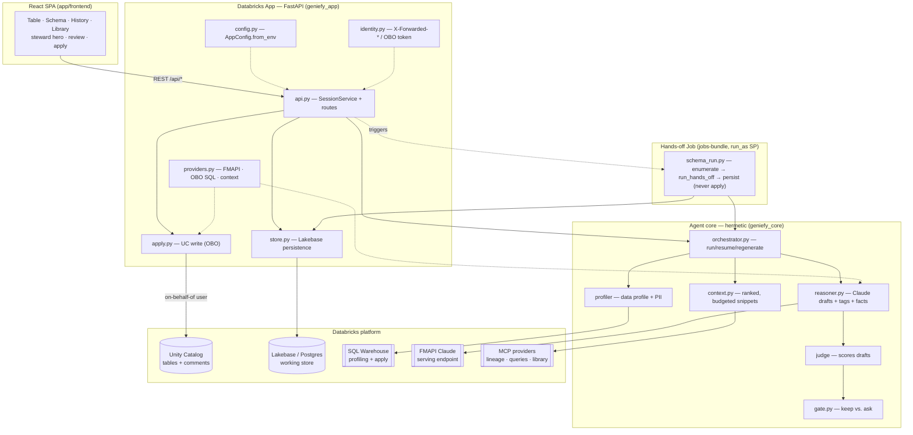
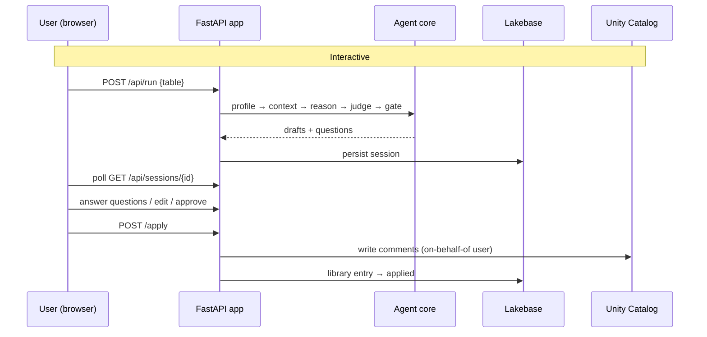
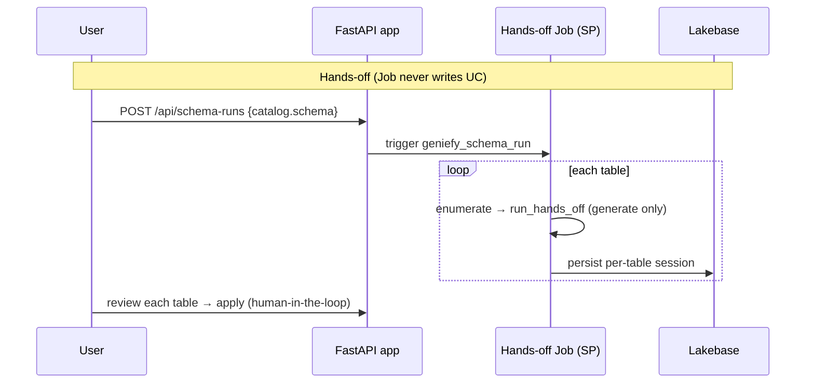

# geniefy-lite — Architecture

A consolidated view of how geniefy-lite is put together.

---

## 1. What it is

geniefy-lite is an **agent that documents Unity Catalog tables** — it profiles a table's data and
gathers usage context, then has Claude draft reviewable, template-conformant **table and column
comments** (plus steward facts and tags) that make the table AI-/Genie-ready. It ships as a
**Databricks App**: a FastAPI backend + a React SPA over a reusable, hermetic agent core, with a
governed, human-approved path to write the comments back to Unity Catalog.

It runs in two modes:

- **Interactive** — point at one table, watch the agent work, answer its clarifying questions, edit,
  and apply.
- **Hands-off** — point at a whole `catalog.schema`; a Databricks Job documents every table in the
  background; you come back to review/clarify/apply. **The Job never writes to Unity Catalog** — every
  apply is human-in-the-loop.

## 2. Design principles

| Principle | What it means in the code |
|---|---|
| **Hermetic core** | `geniefy_core` has no I/O — no network, DB, or SDK. All side effects are injected (LLM client, context providers, store). This makes the whole agent unit-testable with fakes (375 tests, no infra). |
| **Governed apply** | Writes to Unity Catalog only happen on explicit human approval, **on-behalf-of the user** (their UC grants), never the service principal. The hands-off Job generates but never applies. |
| **Config, not code** | Model endpoint, token budgets, thresholds, and MCP context providers are `GENIEFY_*` env vars in [`app/app.yaml`](../app/app.yaml) — change behavior without a code change. |
| **Grant-safe deploy** | App code redeploys (`deploy.sh --code-only`) never reconcile app resources, so UI-added resource bindings + SP grants survive. The hands-off Job lives in a **separate bundle** so its `bundle deploy` can't touch the app. |
| **Suggestion-grounded** | Every generated comment is grounded in the profile + retrieved context; the Judge scores it; low-confidence items become questions rather than confident guesses. |

## 3. Component map

## 4. The agent core pipeline

`geniefy_core.orchestrator` runs a fixed loop over a `SessionState`:

1. **Profile** (`profiler`) — sample the table via the SQL warehouse: row count, per-column null
   fraction, distinct/cardinality ratio, top-k values, enum candidates, and PII detection.
2. **Gather context** (`context.py`) — pull grounding from pluggable providers: the **comment library**
   (approved canonical wording to reuse), and MCP providers (lineage, popular queries, Glean/Confluence).
   Snippets are relevance-ranked and fit to a token budget.
3. **Reason** (`reasoner.py`) — Claude drafts a prose table comment, per-column comments, free-form
   **tags**, and structured **steward facts** (owner · freshness · grain · keys · sensitivity), grounded
   in the profile + context, preferring approved library wording when it fits.
4. **Judge** — score each draft on completeness · specificity · grounding · template-conformance.
5. **Gate** (`gate.py`) — keep high-confidence drafts; turn low-confidence ones (and, in hands-off mode,
   anything uncertain) into **questions** for the human, each with a suggested answer.

`resume(answers)` re-runs reason/judge/gate for answered targets; `regenerate(targets)` re-drafts named
cards only. The core returns a `StepResult`; **all persistence and UC writes happen in `geniefy_app`,
never in the core.**

## 5. Two modes (sequence)

## 6. Data layer (Lakebase / Postgres)

A dedicated `geniefy` database (schema `geniefy`) on Lakebase is the working store. A fresh connection
is opened per operation (Autoscaling scale-to-zero + ~1 h OAuth expiry make long-lived connections
unsafe). Key tables:

- **`sessions`** — one per documentation run (target, status/phase, mode, `schema_run_id` FK).
- **table/column drafts** — proposed comments, confidence, judge scores, evidence refs, tags, facts.
- **`comment_library`** — reusable canonical comments with a lifecycle `approved → applied → sunset`
  (sunset is soft + revivable); reused as suggestion-only grounding on future runs.
- **`schema_runs`** — one per hands-off run (catalog/schema, status, rollup counts, job run id).
- **`audit_log`** — every apply, stamped with the **real user** as actor.

Schema is created/evolved by idempotent SQL in [`migrations/`](../migrations) (run by `deploy.sh` or the
`geniefy_setup` job), branch-aware (dev vs prod Lakebase branch).

## 7. Security & identity model

- **Service principal (SP)** does the reads: profiling, context gathering, the Lakebase store, library
  reads, and the entire hands-off Job.
- **The user identity (OBO)** does exactly one thing: the **apply write to Unity Catalog**. The app
  forwards the user's `X-Forwarded-Access-Token` so the write honors *their* UC grants and the audit log
  records *them* — never a silent SP write.
- **Tokens** (FMAPI bearer, Lakebase credential) are minted **per call**, session-bound, never stored.
  Secrets in `app.yaml` are **secret-scope references**, never raw values.
- **Apply is never automatic** — always human-in-the-loop, in both modes.

## 8. Deployment topology

Two independent Databricks Asset Bundles, deployed by two scripts, kept separate **for grant safety**:

| Bundle | Script | Contains | Why separate |
|---|---|---|---|
| App (`databricks.yml`) | [`deploy.sh`](../deploy.sh) | the Databricks App + `geniefy_setup` migration job | `--code-only` (bundle sync + `apps deploy`) skips resource reconciliation → UI-added Lakebase/FMAPI bindings + SP grants survive every code redeploy |
| Jobs (`jobs-bundle/databricks.yml`) | [`deploy_jobs.sh`](../deploy_jobs.sh) | the standalone `geniefy_schema_run` hands-off Job (`run_as` the app SP) | its own `bundle deploy` never reconciles the app, so deploying the Job can't drop the app's grants |

External dependencies: **Lakebase** (Autoscaling Postgres, branched dev/prod), an **FMAPI Claude**
serving endpoint, and a **SQL warehouse**. The agent core + backend are *staged into* `app/` and
`jobs-bundle/` at deploy time (they run from source via `PYTHONPATH`, not pip-installed) — these staged
copies are git-ignored build artifacts.

## 9. Where things live

| Path | Role |
|---|---|
| [`src/geniefy_core/`](../src/geniefy_core) | hermetic agent core (state · profiler · context · reasoner · judge · gate · orchestrator) |
| [`src/geniefy_app/`](../src/geniefy_app) | FastAPI backend, Lakebase store, providers, OBO apply, identity, config, hands-off driver |
| [`app/frontend/`](../app/frontend) | Vite + React + TS + Tailwind + TanStack Query SPA |
| [`app/`](../app) | App entry (`main.py`), `app.yaml` runtime config, runtime `requirements.txt` |
| [`jobs/`](../jobs), [`jobs-bundle/`](../jobs-bundle) | hands-off Job entrypoint + its standalone bundle |
| [`migrations/`](../migrations) | idempotent Lakebase schema migrations + runner |
| [`tests/`](../tests) | hermetic test suite (375 tests, no infra) |
| [`docs/`](.) | Architecture guide, deploy guide, screenshots |

## 10. Further reading

- [`docs/DEPLOY.md`](DEPLOY.md) — full deployment guide with prerequisites, steps, and flags
- [`README.md`](../README.md) — overview and quick-start instructions
