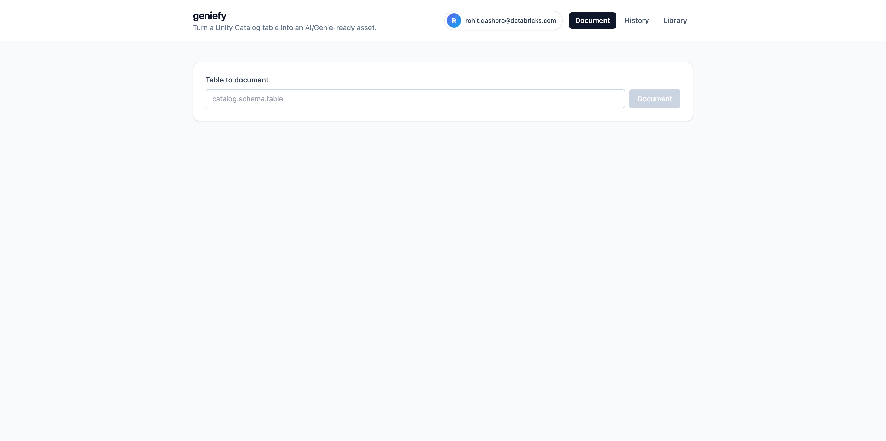
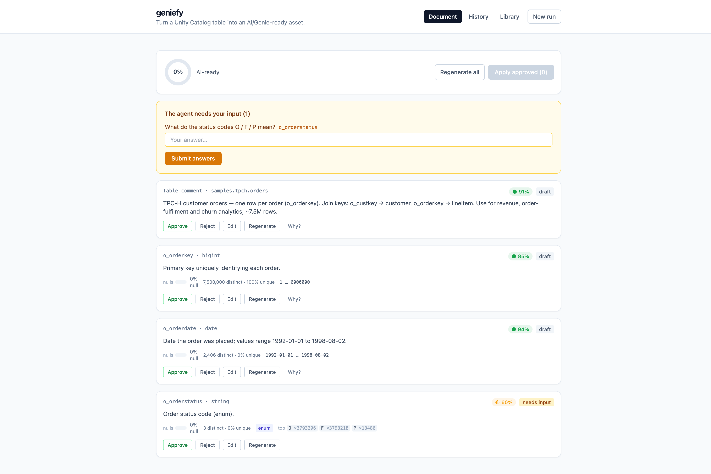
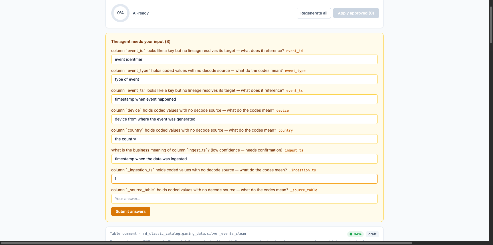
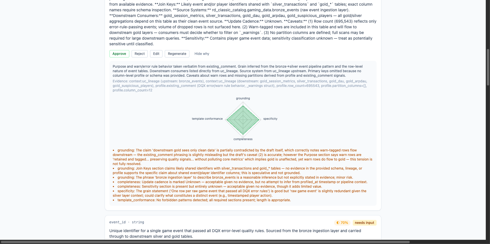
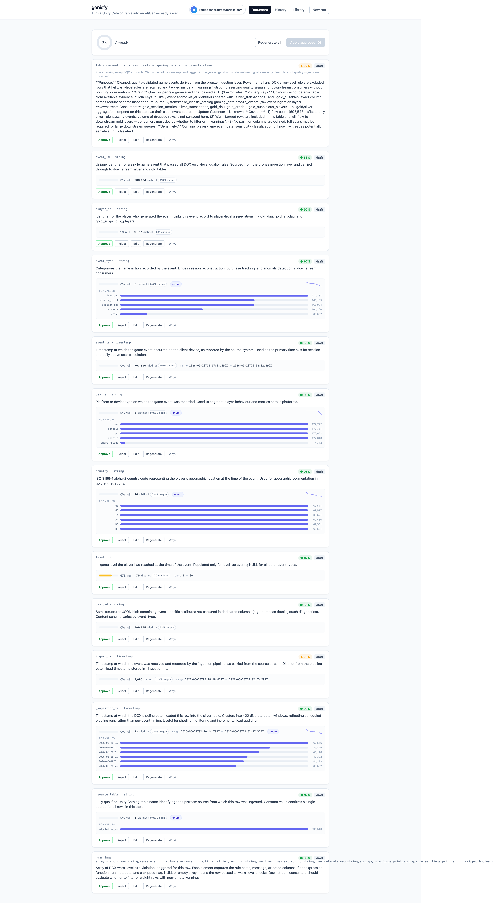
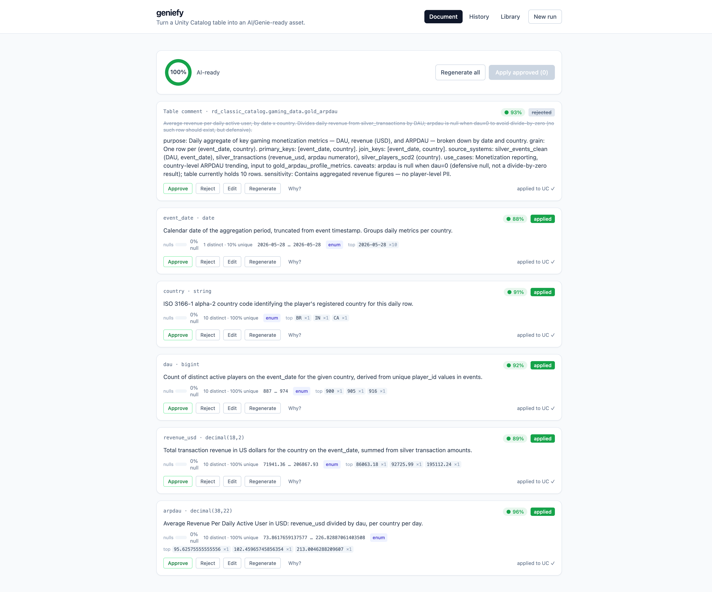

# geniefy-lite — product tour

A visual walkthrough of geniefy-lite documenting a Unity Catalog table, following the agent's flow:
**point at a table → watch it draft → review with confidence + explainability → answer the agent's
questions → apply, human-approved.** For the architecture behind these screens, see
[`ARCHITECTURE.md`](ARCHITECTURE.md); for live deploy/verification evidence, see
[`DEPLOY_VERIFY.md`](verify/DEPLOY_VERIFY.md) and its siblings ([`R2`](verify/DEPLOY_VERIFY_R2.md),
[`R3-005`](verify/DEPLOY_VERIFY_R3-005.md), [`R3-006`](verify/DEPLOY_VERIFY_R3-006.md)) under [`verify/`](verify/).

> **Note on branding.** These screenshots were captured on a pre-R4 build, so the header reads
> *“geniefy”* and the first nav tab is *“Document”*. The product is now **geniefy-lite** and that tab
> is **“Table”** (rename only — the screens and flow are otherwise unchanged).

---

## 1. Point at a table

The entry point. You type a `catalog.schema.table` and the agent does the rest. The header shows the
**signed-in user** (avatar + email) — geniefy-lite knows who you are, and any write back to Unity
Catalog later happens **on-behalf-of you**, honoring your grants. **History** lists past runs;
**Library** holds reusable approved comments.

## 2. Review the drafts — confidence as a first-class signal

Every draft — the table comment and each column — carries a **confidence chip** from an independent
Judge, and each column shows the **profile stats it was grounded in** (distinct count, null fraction,
min–max range, sample values). High-confidence drafts are ready to approve; a low-confidence one (here
`o_orderstatus` at 60%) is flagged **needs input** rather than guessed. Per draft you can **Approve,
Reject, Edit in place, Regenerate, or ask “Why?”**

## 3. Answer the agent's questions — with suggested answers

When the agent is unsure (an enum with no decode source, a key whose target lineage doesn't resolve),
it **asks instead of hallucinating**. Each question comes with an **LLM-suggested answer pre-filled**,
so you confirm or correct rather than write from scratch. Submitting folds your answers back in as
evidence and re-drafts only the affected comments.

## 4. See *why* the agent decided this

“Why?” opens the **explainability view**: a **Judge radar** of the rubric subscores that produced the
confidence, alongside the reasoning behind the wording. The score isn't a black box — you can see what
the Judge rewarded and where it hesitated.

## 5. Read each column as a data fingerprint

The profile isn't just numbers — each column renders as a small **“data fingerprint”**: **MiniBars**
for top value frequencies, null/uniqueness meters, a min–max range bar, and **data-type + tag pills**.
The visual context makes it fast to sanity-check a draft against the data it describes.

## 6. Apply — and watch the table become AI-/Genie-ready

Approve what you trust and **Apply** — the comments are written to Unity Catalog (on-behalf-of you),
each item marked **applied**, and the readiness ring fills to **100% AI-ready**. The table now carries
exactly the structured metadata Genie, AI/BI, and text-to-SQL agents read.
